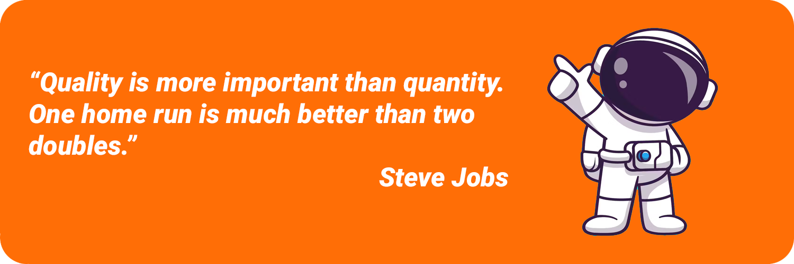

    

    <h3>
        Hi there! My name is Dima. I'm delighted to have you here!
        
    </h3>

---

  <a href="">
     
       
     
  </a>

---

Welcome to my repository, a collection of my projects, both public and private!

- I'm a Software Engineer dedicated to hunting down and fixing bugs.
- I absolutely love coding.
- I'm really into software quality assurance automation.
- I'm super passionate about automation and embracing CI/CD best practices.
- I'm always excited to learn and share my knowledge.

I'm sure we share a commitment to delivering top-notch software and ensuring the best user experience!

---

Feel free to join! :handshake:

